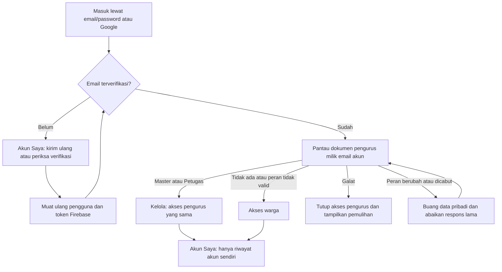

# Autentikasi dan aktor — RW 02 Sukatani

Diperbarui: 8 September 2026. Lingkup: masuk/daftar/verifikasi email, peran,
akses Firestore, pergantian sesi, riwayat pribadi, dan draf surat.

## 1. Keputusan akses yang menjadi acuan

Pemilik menegaskan bahwa **Petugas dan Master Admin mempunyai hak yang sama**.
Kedua peran dapat mengurus layanan, isi situs, data warga, serta memberikan dan
mencabut akses pengurus lain. Nama peran membedakan jabatan, bukan kewenangan.

| Tindakan | Pengunjung | Warga terverifikasi | Petugas | Master Admin |
| --- | --- | --- | --- | --- |
| Membaca informasi publik | Ya | Ya | Ya | Ya |
| Mengirim pengaduan publik tanpa nama | Ya | Ya | Ya | Ya |
| Membaca kiriman pribadi | Tidak | Milik sendiri | Semua di Kelola | Semua di Kelola |
| Melihat riwayat di Akun Saya | Tidak | Milik sendiri | Milik sendiri | Milik sendiri |
| Mengajukan surat, pinjaman, usaha | Tidak | Ya | Ya | Ya |
| Mengubah isi situs/menangani kiriman | Tidak | Tidak | Ya | Ya |
| Mengesahkan atau menolak profil warga | Tidak | Tidak | Ya | Ya |
| Melihat seluruh daftar akun pengurus | Tidak | Tidak | Ya | Ya |
| Membaca dokumen peran sendiri | Tidak | Ya | Ya | Ya |
| Menambah/mengubah/mencabut pengurus lain | Tidak | Tidak | Ya | Ya |
| Mencabut hak diri sendiri | Tidak | Tidak | Tidak | Tidak |
| Menghapus profil warga | Tidak | Tidak | Tidak | Tidak |

Email yang belum diverifikasi tidak memperoleh akses pengurus atau akses data
pribadi yang mensyaratkan verifikasi. Pengecualian pengaduan anonim/tidak
terverifikasi tetap mengikuti aturan proyek yang sudah ada. Isi pengaduan
bersifat publik; kontak pelapor disimpan terpisah.

## 2. Tiga hal yang berbeda

| Bagian | Fungsi | Lokasi |
| --- | --- | --- |
| Authentication | Identitas pengguna, UID, email, penyedia login, email terverifikasi | Firebase Authentication |
| Profil warga | Nama, rumah, RT, kontak, status baru/aktif/ditolak | Firestore `warga/{uid}` |
| Hak pengurus | Nama, jabatan, penanda Petugas/Master Admin | Firestore `pengurus/{email}` |

Membuat pengguna di Authentication **tidak otomatis memberikan peran pengurus**.
Sebaliknya, menambah dokumen pengurus tidak membuat akun login. Pengesahan
profil warga juga tidak mengubah warga menjadi petugas.

ID dokumen pengurus harus cocok dengan email Authentication dalam huruf kecil.
Alamat bertanda `+` harus tetap utuh: `ketua+rw02@example.test` berbeda dari
`ketua@example.test`. Tidak ada alias login berdasarkan nama akun.

| Dokumen pengurus | Hasil |
| --- | --- |
| Tidak ada | Warga |
| `peran: "petugas"` | Petugas |
| `peran: "master"` | Master Admin |
| Dokumen lama tanpa kolom `peran` | Master Admin, untuk kompatibilitas bootstrap |
| Kolom `peran` ada tetapi null, kosong, salah ketik, atau tipe lain | Tidak mendapat akses pengurus |

Parameter `hash_config`/SCRYPT adalah konfigurasi hash password untuk impor atau
migrasi akun. Parameter tersebut **tidak menentukan aktor** dan tidak diperlukan
untuk perbaikan peran ini. Signer key tidak disimpan dalam kode, dokumen ini,
berkas uji, maupun PR. Rujukan: [Firebase auth import/export](https://firebase.google.com/docs/cli/auth).

## 3. Alur yang diterapkan

Pemantauan dokumen peran memperbarui tampilan saat akses diberikan, diubah, atau
dicabut. Listener lama dilepas ketika akun berubah. Respons profil/kiriman yang
masih berjalan tidak boleh mengembalikan data sesi atau peran sebelumnya.
Pembaruan token rutin tanpa perubahan identitas/verifikasi tidak mengosongkan
formulir.

## 4. Masalah dan perbaikan

| Masalah sebelumnya | Perbaikan |
| --- | --- |
| Data pribadi tertinggal setelah keluar atau ganti akun | Data khusus akun dibersihkan; hasil permintaan sesi lama diabaikan |
| Peran hanya dibaca sekali | Dokumen peran dipantau selama sesi aktif |
| Login ulang dengan UID sama dapat mengganti objek sesi | Pantauan ikut diganti bila objek akun berubah; penyegaran token rutin tetap tidak mereset form |
| Semua nilai selain `petugas` dianggap Master Admin | Pembacaan peran dipusatkan dan hanya menerima nilai sah; bootstrap tanpa kolom tetap didukung |
| Server memberi hak cukup dari keberadaan dokumen | Rules memeriksa nilai peran juga |
| Email di client dinormalisasi, rules memakai email mentah | Lookup dan perlindungan pencabutan diri memakai email huruf kecil |
| Warga dapat membaca daftar email pengurus | Warga hanya membaca dokumen peran sendiri; daftar hanya untuk pengurus |
| Daftar pengurus bisa tertimpa ketika riwayat pribadi dimuat | Antrean Kelola dan riwayat Akun Saya memakai penyimpanan keadaan terpisah |
| Pengurus diarahkan mendaftar sebagai warga | Status aktor dan tautan Kelola ditampilkan sesuai peran |
| Riwayat tersembunyi sebelum profil warga lengkap | Riwayat pribadi ditampilkan terpisah dari formulir profil |
| Kiriman baru belum terlihat ketika kembali ke Akun Saya | Riwayat dimuat ulang saat halaman Akun Saya dibuka |
| Gagal membaca profil/riwayat tampak seperti data kosong | Galat dibedakan dari belum ada data, disertai tindakan memuat ulang |
| Status verifikasi membutuhkan keluar/masuk ulang | Tombol Saya sudah verifikasi memperbarui data akun dan token server |
| Akun sudah dibuat tetapi email verifikasi gagal dikirim | Pesan menjelaskan akun sudah ada dan memberi jalur kirim ulang |
| Kolom login menawarkan nama akun yang belum didukung | Formulir meminta alamat email dan menjelaskan pilihan Google |
| Tombol Hapus warga selalu ditolak rules | Tombol dihapus; Sahkan/Tolak tetap tersedia |
| Formulir edit bootstrap menampilkan peran berbeda | Label dan formulir menggunakan pembacaan peran yang sama |
| Draf cetak berisi NIK disimpan tanpa pemilik di localStorage | Draf hanya di memori sesi dan terikat UID; salinan lama dibersihkan |
| Akun berubah saat penulisan kontak pengaduan menunggu | Identitas dan isian disalin saat kirim; tahap kontak dan hasil UI dihentikan bila sesi berubah |

Draf cetak berlaku selama sesi halaman saat ini. Memuat ulang halaman atau
keluar menghapus draf cetak; pengajuan yang sudah terkirim tetap berada di
Firestore dan dapat dilacak melalui Akun Saya. Respons pengiriman yang selesai
setelah pergantian akun tidak menyimpan draf ke sesi akun baru.
Pengaduan utama tetap tersimpan jika kontak gagal atau sesi berganti setelah
laporan dikirim; sistem tidak mengirim ulang laporan tersebut otomatis.

## 5. Struktur implementasi

- `src/inti/nama.js`: nama koleksi, nilai peran, pembacaan dokumen peran, normalisasi email.
- `src/sumber/akun.js`: operasi Authentication dan pemeriksaan ulang verifikasi.
- `src/sumber/data.js`: pembacaan/pantauan peran dan operasi Firestore.
- `src/keadaan/mulai.js`: koordinasi akun, peran, penghentian listener, dan pembatalan hasil sesi lama.
- `src/keadaan/isi.svelte.js`: data umum, antrean pengurus, dan riwayat pribadi yang terpisah.
- `src/keadaan/sesi.svelte.js`: identitas, peran, status kesiapan, dan galat akun.
- `src/inti/draf-surat.js`: draf cetak sementara yang hanya dapat dibaca UID pemiliknya.
- `src/halaman/Akun.svelte`, `Masuk.svelte`, dan `kelola/`: tampilan berdasarkan keadaan yang sudah diperiksa.
- `firestore.rules`: penegakan hak akses di server; pemeriksaan tampilan bukan pengganti rules.
- `alat/`: pengujian regresi sesi dan pengujian aturan aktor lewat emulator.

Arah impor empat lapis proyek tetap dipertahankan. Tidak ada Firebase Admin SDK,
service-account key, password, atau parameter hash privat di frontend.

## 6. Pemeriksaan dan bukti

| Pemeriksaan lokal | Hasil |
| --- | --- |
| Regresi sesi, peran, verifikasi, riwayat, draf, dan pengaduan (`npm test`) | 31 pengujian lolos |
| Rules Firestore (`npm run test:rules`) | 19 pengujian lolos |
| Arsitektur (`npm run periksa`) | Lolos |
| Build produksi (Vite) | Lolos; peringatan ukuran bundel di atas 500 kB |

Total **50 pengujian otomatis lolos**. Pengujian sesi dan handler pengaduan
memakai Firebase tiruan dan bukan bukti render/reaktivitas Svelte;
pengujian rules menjalankan Firestore Emulator 1.19.8 dengan identitas uji,
proyek `demo-rw02-aktor`, dan host lokal. Keduanya tidak menggunakan akun warga
produksi. Firebase CLI 14.22.0 dipin agar cocok dengan Java 17; saat mengubah
versi CLI, periksa kembali persyaratan Java. Java 17 juga disiapkan pada CI.

Pengujian rules mencakup pengelolaan pengurus dan konten oleh kedua peran,
bootstrap lama, peran tidak valid, email huruf campuran, larangan mencabut hak
diri, isolasi data privat warga, penolakan UID palsu, pencabutan hak, serta
akses publik dan pengaduan anonim. Workflow PR menjalankan seluruh pemeriksaan;
workflow deployment juga menjalankan tes sebelum mengunggah berkas Pages.

Pemeriksaan browser telah mencakup mode Masuk, Daftar, dan Lupa sandi. Login
Google/password produksi, pengiriman email, dan pemetaan akun asli belum
divalidasi lewat akun pengelola yang berizin. Panel Console yang diperiksa ulang
pada 8 September masih meminta login Google.

Pemeriksaan produksi tetap perlu dilakukan terhadap penyedia login, domain yang
diizinkan, email aktor sebenarnya, dan rules yang sedang aktif. Jumlah pengguna
pada tangkapan layar bukan bukti bahwa ketiga aktor sudah dipetakan dengan benar.

## 7. Penerapan ke produksi

1. Tinjau perubahan pada PR beserta hasil pengujiannya.
2. Masuk ke proyek Firebase `perumahansukatanirw02` sebagai pengelola.
3. Cocokkan email lengkap akun pengurus dengan ID dokumen Firestore. Periksa
   dokumen yang memiliki kolom peran tidak valid; ubah hanya setelah jabatan
   orang tersebut dipastikan. Bootstrap lama tanpa kolom peran tetap didukung.
4. Pasang seluruh `firestore.rules` yang sudah diuji pada proyek yang benar.
   Perubahan berkas di GitHub tidak otomatis mengubah rules produksi.
5. Terapkan frontend melalui alur GitHub Pages proyek setelah rules terpasang.
6. Uji login, verifikasi, riwayat sendiri, akses Kelola kedua peran, dan
   pencabutan akses menggunakan akun yang memang disetujui untuk pengujian.

Urutan rules sebelum frontend menjaga agar keputusan akses di server sudah
berlaku ketika tampilan baru dipakai. Penerapan tidak memerlukan perubahan hash
password, pembuatan password baru, atau impor massal akun.

## 8. Yang masih memerlukan akses pengelola

Firebase CLI mempunyai sesi akun tersimpan, tetapi pembacaan metadata proyek
`perumahansukatanirw02` menghasilkan **HTTP 403: The caller does not have
permission**. Sesi login saja belum membuktikan izin terhadap proyek ini.

- Memeriksa dan menyesuaikan akun serta peran yang benar-benar ada di Firebase.
- Memastikan Email/Password dan Google aktif sesuai dua jalur masuk situs.
- Memastikan `rayen467.github.io` masuk Authorized domains dan pengaturan email
  verifikasi sesuai proyek.
- Memasang rules produksi dan memverifikasi login nyata setelah penerapan.

Perbaikan kode dan pengujian lokal tidak dinyatakan sebagai bukti bahwa
konfigurasi Firebase produksi sudah berubah.
